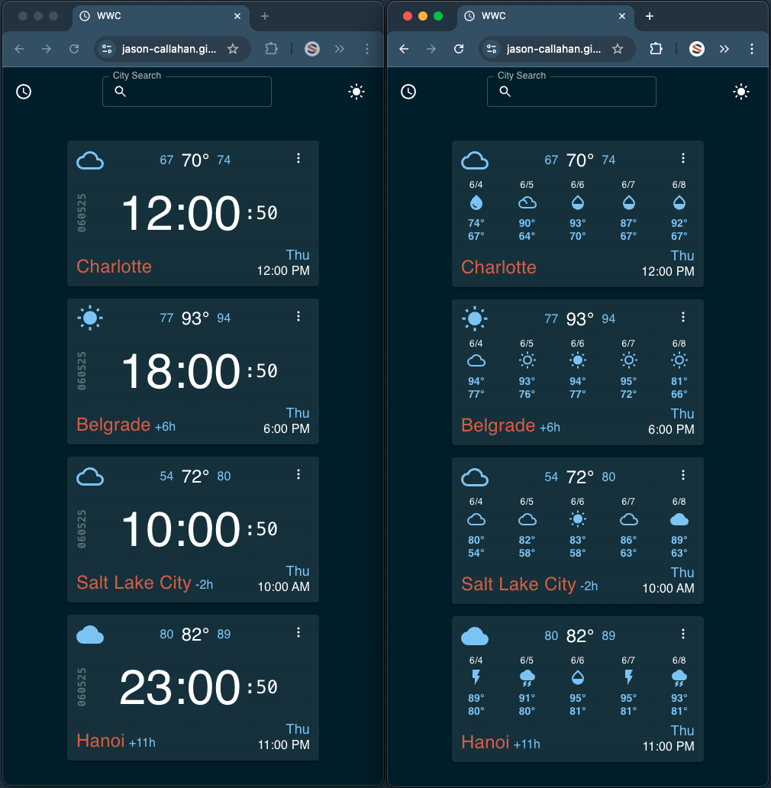
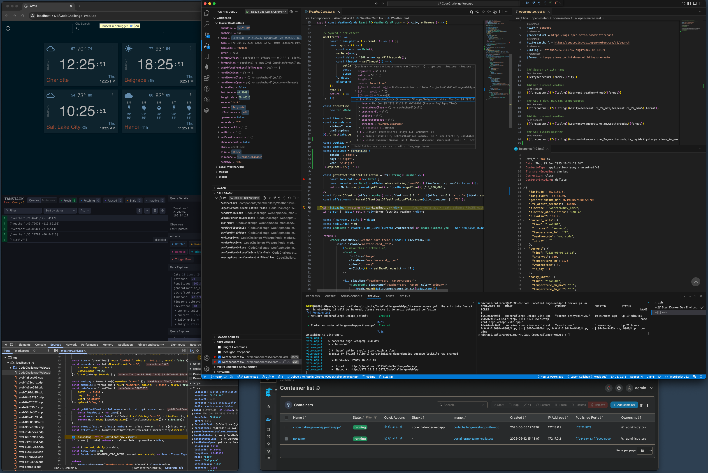

# World Weather Clock  
#### _It's a world clock, with weather!_  
Local time and weather for your global team—at a glance.  
A fun cross-platform web app built with the developer experience, performance, and efficiency in mind.
<br/>  
_**See it in action here: https://jason-callahan.github.io/CodeChallenge-WebApp/**_



## About this project:
This project was a submission for a code challenge where I focused heavily on the developer experience to create a cross-platform application leveraging modern technologies. These technologies offer a helpful and efficient workflow. I also explored an open weather API: [open-meteo](https://open-meteo.com/en/docs).

## Features & How to use
- Search by city using the City Search input to add clock/weather cards to the home page.
- Switch between dark and light mode.
- Local storage is used to save cards and dark mode preference.
- Click the current weather icon to see a 5-day forecast.
- Delete a card using the card menu.

## Technology & Developer Experience

### React + TypeScript + Vite + Docker + Tauri + Android

- VS Code for the IDE
  - Launch files for in-container live debugging in VS Code and hot-reloading.
- React and TypeScript for modular, type-safe JS components.
- Vite for rapid web app development and builds.
- Tauri wraps the web app for desktop (macOS, Windows, Linux).
  - This includes a hot-reloading native app debugging experience.
- Capacitor enables Android native builds.
- Docker and Docker Compose provide containerized environments.
- TanStack React Query and Devtools make API calls, caching, and debugging easy!

## The Development Experience



## Scripts & Commands

### Web (React + TypeScript + Vite)
```bash
npm run dev         # Start development server
npm run build       # Build production web app
npm run preview     # Preview production build
```

### Desktop (Tauri)
```bash
npm run tauri build # Build desktop app
npm run tauri dev   # Run desktop app in dev mode
```

### Android (Capacitor)
```bash
npx cap sync
npx cap open android
cd android/
./gradlew clean
./gradlew assembleDebug
adb install -r app/build/outputs/apk/debug/app-debug.apk
```

### Docker
```bash
docker build -t your-app-name .
docker run -p 3000:3000 your-app-name
```

### Docker Compose
```bash
docker-compose up
docker-compose down
```
<br/>

### Build Scripts

Automate builds for different platforms:

```bash
npm run tauri build      # Build desktop app
./build_android.sh       # Build Android app
```

The `build_android.sh` script:

1. Syncs web assets with Capacitor.
2. Navigates to the Android directory.
3. Updates Gradle config.
4. Cleans previous builds.
5. Assembles a new debug APK.
6. Installs the APK on a connected device.

## VS Code Task: Start Docker Dev Environment

Automate Docker environment startup in VS Code with a custom task:

- **Purpose**: Start all containers using `docker-compose up`.
- **How**:
  - Run from Command Palette or shortcut.
  - Executes `docker-compose up` in your project folder.
  - Runs in the background until stopped.

**Task Properties:**
- `label`: "Start Docker Dev Environment"
- `type`: "shell"
- `command`: "docker-compose up"
- `isBackground`: `true`
- `problemMatcher`:
  - `beginsPattern`: "Creating"
  - `endsPattern`: "ready in" (adjust as needed)
- `options.cwd`: `${workspaceFolder}`

## VS Code Debugging (launch.json)

Configure VS Code to debug your Vite React + TypeScript app in Chrome:

- **name**: Label in Run and Debug panel.
- **type**: `chrome` (debug in Google Chrome).
- **request**: `"launch"` (starts new Chrome instance).
- **url**: Local address (default: http://localhost:5173).
- **webRoot**: Maps to `src` for source debugging.
- **preLaunchTask**: Runs "Start Docker Dev Environment" before debugging.
- **postDebugTask**: Runs "Stop Docker Dev Environment" after debugging.
- **sourceMaps**: Enables TypeScript/JSX debugging.
- **breakOnLoad**: Pauses on first line for breakpoints.

**Usage:**  
Select "Debug Vite App in Chrome" in the Run and Debug panel and start debugging. This launches Chrome, attaches the debugger, and manages your Docker environment if configured.

---

### Deploy to GitHub Pages
```bash
npm run deploy  
```

---

#### Links

- [React](https://react.dev/docs) – JavaScript library for building user interfaces
- [TypeScript](https://www.typescriptlang.org/docs/) – Statically typed JavaScript
- [Vite](https://vitejs.dev/guide/) – Fast front-end build tool
- [Tauri](https://tauri.app/v1/guides/) – Framework for lightweight, secure desktop apps
- [Capacitor](https://capacitorjs.com/docs) – Cross-platform native runtime for mobile apps
- [Android](https://developer.android.com/docs) – Mobile OS for app deployment
- [Docker](https://docs.docker.com/) – Containerization for consistent environments
- [Docker Compose](https://docs.docker.com/compose/) – Multi-container orchestration
- [Gradle](https://docs.gradle.org/current/userguide/userguide.html) – Build automation for Android
- [npm](https://docs.npmjs.com/) – JavaScript/TypeScript package manager
- [VS Code](https://code.visualstudio.com/docs) – Code editor with integrated tasks/debugging
- [MUI (Material UI)](https://mui.com/material-ui/getting-started/overview/) – React UI component library
- [ADB](https://developer.android.com/tools/adb) – Android Debug Bridge for device management
- [TanStack React Query](https://tanstack.com/query/latest) – Powerful data fetching, caching, and synchronization for React
- [TanStack React Query Devtools](https://tanstack.com/query/latest/docs/devtools) – Debug and inspect React Query caches and requests
- [Open-Meteo](https://open-meteo.com/en/docs) – Free weather API used for weather data

## Performance


