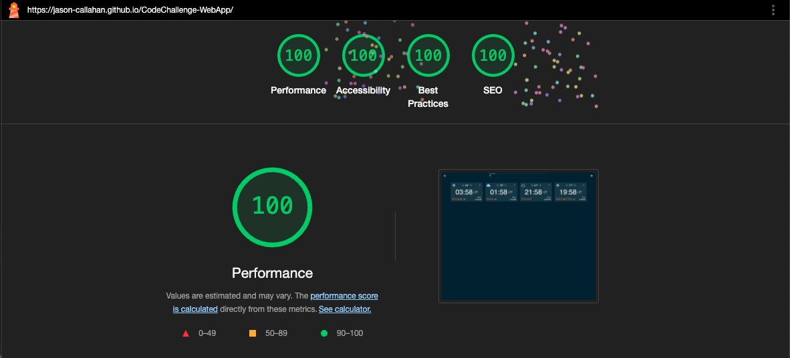

# React + TypeScript + Vite + Docker + Tauri + Android

https://jason-callahan.github.io/CodeChallenge-WebApp/

This project is a cross-platform application leveraging modern technologies:

- **React**: JavaScript library for building user interfaces.
- **TypeScript**: Adds static typing for improved code quality.
- **Vite**: Fast build tool and development server.
- **Docker**: Containerizes the app for consistent deployment.
- **Docker Compose**: Orchestrates multi-container setups.
- **Tauri**: Builds lightweight desktop apps using web tech.
- **Android (via Capacitor)**: Packages the app as a native Android application.

---

## How It Works

- Develop with React and TypeScript.
- Use Vite for rapid development and builds.
- Tauri wraps the web app for desktop (macOS, Windows, Linux).
- Capacitor enables Android native builds.
- Docker and Docker Compose provide containerized environments.

---

## Commands

### Web (React + TypeScript + Vite)
```bash
npm run dev         # Start development server
npm run build       # Build production web app
npm run preview     # Preview production build
```

### Desktop (Tauri)
```bash
npm run tauri build # Build desktop app
npm run tauri dev   # Run desktop app in dev mode
```

### Android (Capacitor)
```bash
npx cap sync
npx cap open android
cd android/
./gradlew clean
./gradlew assembleDebug
adb install -r app/build/outputs/apk/debug/app-debug.apk
```

### Docker
```bash
docker build -t your-app-name .
docker run -p 3000:3000 your-app-name
```

### Docker Compose
```bash
docker-compose up
docker-compose down
```

---

## Build Scripts

Automate builds for different platforms:

```bash
npm run tauri build      # Build desktop app
./build_android.sh       # Build Android app
```

The `build_android.sh` script:

1. Syncs web assets with Capacitor.
2. Navigates to the Android directory.
3. Updates Gradle config.
4. Cleans previous builds.
5. Assembles a new debug APK.
6. Installs the APK on a connected device.

---

## VS Code Task: Start Docker Dev Environment

Automate Docker environment startup in VS Code with a custom task:

- **Purpose**: Start all containers using `docker-compose up`.
- **How**:
  - Run from Command Palette or shortcut.
  - Executes `docker-compose up` in your project folder.
  - Runs in the background until stopped.

**Task Properties:**
- `label`: "Start Docker Dev Environment"
- `type`: "shell"
- `command`: "docker-compose up"
- `isBackground`: `true`
- `problemMatcher`:
  - `beginsPattern`: "Creating"
  - `endsPattern`: "ready in" (adjust as needed)
- `options.cwd`: `${workspaceFolder}`

> **Note:**  
> Adjust `endsPattern` to match your container output.

---

## VS Code Debugging (launch.json)

Configure VS Code to debug your Vite React + TypeScript app in Chrome:

- **name**: Label in Run and Debug panel.
- **type**: `chrome` (debug in Google Chrome).
- **request**: `"launch"` (starts new Chrome instance).
- **url**: Local address (default: http://localhost:5173).
- **webRoot**: Maps to `src` for source debugging.
- **preLaunchTask**: Runs "Start Docker Dev Environment" before debugging.
- **postDebugTask**: Runs "Stop Docker Dev Environment" after debugging.
- **sourceMaps**: Enables TypeScript/JSX debugging.
- **breakOnLoad**: Pauses on first line for breakpoints.

**Usage:**  
Select "Debug Vite App in Chrome" in the Run and Debug panel and start debugging. This launches Chrome, attaches the debugger, and manages your Docker environment if configured.


---


### Deploy to github pages
```bash
npm run deploy  
```

---

### Tech Used  

- [React](https://react.dev/docs) – UI library
- [TypeScript](https://www.typescriptlang.org/docs/) – typed JavaScript
- [Vite](https://vitejs.dev/guide/) – build tool
- [Docker](https://docs.docker.com/) – containerization
- [Docker Compose](https://docs.docker.com/compose/) – multi-container orchestration
- [Tauri](https://tauri.app/v1/guides/) – desktop apps
- [Capacitor](https://capacitorjs.com/docs) – native mobile wrapper
- [Android](https://developer.android.com/docs) – mobile platform
- [VS Code](https://code.visualstudio.com/docs) – code editor
- [MUI (Material UI)](https://mui.com/material-ui/getting-started/overview/) – React UI component library

- vite - modern front-end build tool
- react - javascript library for building user interfaces
- typescript - adds static typing to javascript
- tauri - framework for building lightweight, secure desktop applications using web technologies
- docker - containerization platform for consistent and reproducible deployments
- docker-compose - tool for defining and running multi-container Docker applications
- capacitor - cross-platform native runtime for building web apps as native mobile apps
- android - mobile operating system for which the app is packaged and deployed
- gradle - build automation tool used for Android builds
- npm - package manager for JavaScript and TypeScript dependencies and scripts
- vscode - code editor with integrated tasks and debugging support
- adb - Android Debug Bridge for installing and debugging Android apps
- shell scripting - automates build and deployment processes
- chrome - browser used for debugging the web app
- json - configuration files for tasks and debugging (e.g., launch.json)  

---

### Lighthouse Preformance

